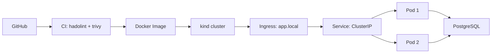

# pipeline-demo

## Health-check simple API
Simple project to demonstrate Docker and Prometheus skills. FastAPI deployed with uvicorn.

## Stack:
- Python 3.12
- FastAPI
- uvicorn
- asyncpg
- PostgreSQL 15
- Docker + Docker Compose
- Prometheus

## Endpoints

- /health - checks if database and service is reachable

- /metrics - returns prometheus metrics

## Setup

1. Clone the repository
```bash
   git clone git@github.com:refactorlord/pipeline-demo.git
   cd pipeline-demo
```

2. Configure environment
```bash
   cp .env.example .env
```

3. Run
```bash
   docker compose up --build
```

4. Check
```bash
   curl http://localhost:8000/health
   curl http://localhost:8000/metrics
```

## Architecture


